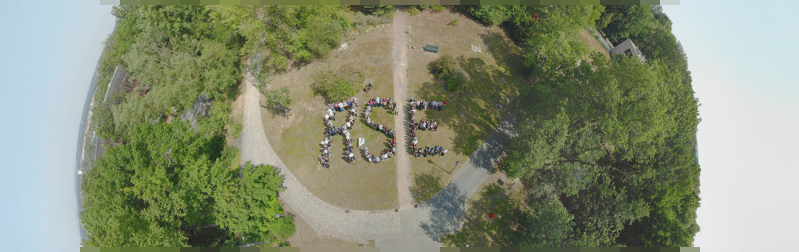

> **Dates:** Tue 15th-Wed 16th September + Wed 30th September 2020 (3 half days)  
> **Location:** online  
> **Application form: <https://bit.ly/intl-rse-leaders-2020-application>**

Photo by Antonia Cozacu, Jan Philipp Dietrich, de-RSE e.V. (CC BY 4.0).

The **2nd International RSE Leaders Meeting** will bring together established and aspiring activists and influencers from the 
international Research Software Engineering community for a three-half-days event of networking, knowledge exchange, 
and hands-on collaboration towards our common goal to establish research software as a first-class citizen in 
research all over the world, and support the creation of academic careers for Research Software Engineers on 
an international level.

We invite people with a vision to start, establish, consolidate, or advance a Research Software Engineering 
community in their own national, regional or domain-specific ecosystem to apply for participation.

In 2018, the first International RSE Leaders Workshop, organized by the UK RSE Association, took place at 
the Alan Turing Institute in London, UK.
It aimed at improving access to software expertise in research, by pooling knowledge, coordinating efforts 
and establishing collaboration.
You can read more about the workshop here: <https://researchsoftware.org/2018/04/23/int-rsel-workshop.html>.

This year's three-half-days is a continuation of that collaboration.
It features one half day (**Tuesday, 15th September 2020**) of presentations, discussions, networking and knowledge exchange with leaders of 
established RSE initiatives, to learn from each other about strategies and options to set up an RSE 
association or group, as well as how to build communities, collaborate, lobby and drive progress in 
Research Software Engineering.
On the second half day of the event (**Wednesday, 16th September 2020**), we will collaborate hands-on to devise solutions for international 
organization and collaboration, and work together to strengthen the role of RSEs in the academic environment.

To support asynchronous collaboration beyond the limited time of the second day, the workshop will feature a third half-day session two weeks after the first two, on **Wednesday, 30th September 2020**. In this third session, collaborative groups will have the chance to present their results, and plan future activities.

Apply for participation if you want to start, or already lead, an RSE community (beyond a single institution) 
and want to connect with like-minded people from the international community.

> **The call for applications is now open! Please apply using this form: <https://bit.ly/intl-rse-leaders-2020-application>.**

The workshop sessions will be run at a time that allows for the broadest participation possible, based on a poll of participants to determine the schedule.

## Organizers

- Alys Brett (Society of Research Software Engineering / UK Atomic Energy Authority / UK)
- Anne Claire Fouilloux (Nordic RSE / University of Oslo / NO)
- Ben van Werkhoven (NL-RSE / Netherlands eScience Center / NL)
- Claire Wyatt (Society of Research Software Engineering / University of Southampton / UK)
- Daniel S. Katz (US-RSE / University of Illinois Urbana-Champaign / USA)
- Eugene de Beste (African RSSE / South African National Bioinformatics Institute / ZA)
- Ian A. Cosden (US-RSE / Princeton University / USA)
- Peter van Heusden (African RSSE / South African National Bioinformatics Institute / ZA)
- Radovan Bast (Nordic RSE / UiT The Arctic University of Norway / NO)
- Simon J. Hettrick (Society of Research Software Engineering / University of Southampton / UK)
- Stephan Druskat (de-RSE - Society for Research Software / German Aerospace Center (DLR), Friedrich Schiller University Jena, Humboldt-Universität zu Berlin / DE)
